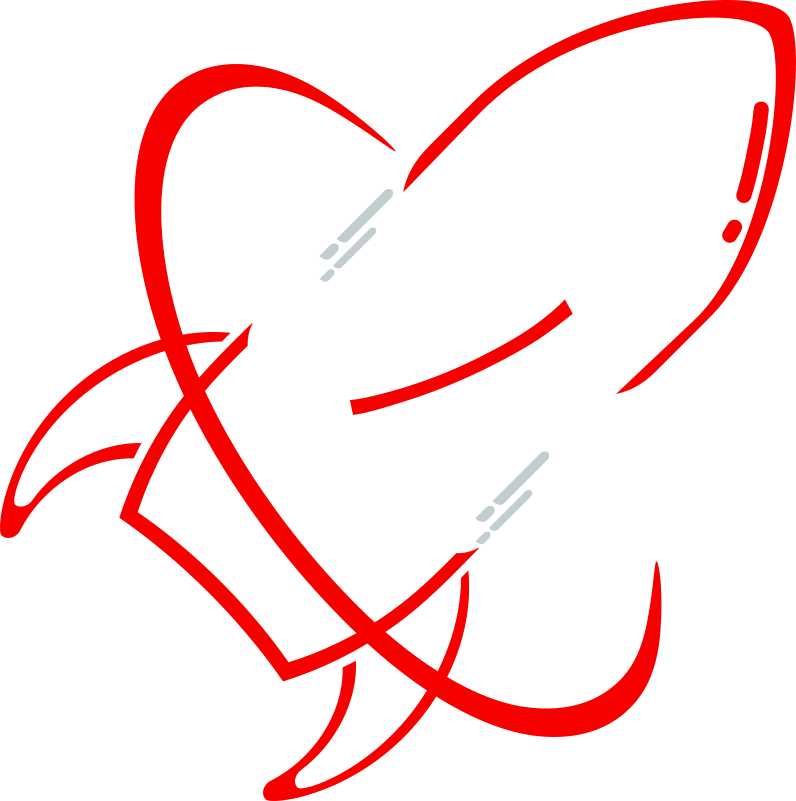

<p align="center">
  
</p>

<h1 align="center">Fusée Framework</h1>

<p align="center">
  <strong>v2.0.0 — Signals-First JS Framework | Atomic Reactivity | Rust Compiler | Go Toolchain</strong>
</p>

<br />

Fusée is a custom, high-performance fine-grained reactive JavaScript framework built for speed and simplicity. It features a recursive, non-greedy Rust compiler, a signals-based reactivity engine, fully integrated Dependency Injection support, file-based routing, and a fully self-contained Go CLI for instant application scaffolding — with an optional Go SSR engine for server-side rendering.

---

## Quick Start

The fastest way to get started with Fusée is via the **Go-Powered CLI**:

```bash
# Install globally from npm
npm install -g fusee-framework

# Scaffold a new project (JS or TS)
fusee init my-app

# Or use the binary directly
create-fusee-app init my-app
```

Follow the interactive prompt to choose **JavaScript** or **TypeScript**, then:

```bash
cd my-app && npm install

# Start in SPA mode (no Go required)
npm run dev:spa     # → Vite dev server on port 5173
```

---

## CLI Commands

The `fusee` CLI is a single self-contained binary (no Node.js runtime needed) compiled for all platforms.

### `fusee init <name>`

Scaffold a new Fusée project. Includes the full framework core, file-based routing, Vite config, and sample pages.

```bash
fusee init my-app           # JavaScript template
fusee init my-app --ts      # TypeScript template
```

### `fusee generate <type> <name>`

Generate boilerplate for common resource types:

```bash
fusee generate page    dashboard   # → app/pages/dashboard.js
fusee generate component Button    # → app/components/Button.js
fusee generate store   auth        # → app/stores/auth.js
fusee generate composable useFetch # → app/composables/useFetch.js
fusee generate action  sendEmail   # → app/actions/sendEmail.js
```

Aliases: `fusee g page dashboard`

### `fusee add server`

Install the optional **Go SSR Engine** into an existing project:

```bash
cd my-app
fusee add server        # → installs framework/engine-go
npm run dev             # → generate manifest + start Go server on port 3000
```

Aliases: `fusee add go-server`, `fusee add engine-go`

---

## Development Modes

| Mode                | Command            | Port | Requires Go |
| ------------------- | ------------------ | ---- | ----------- |
| SPA (Vite)          | `npm run dev:spa`  | 5173 | ❌          |
| SSR (Go server)     | `npm run dev`      | 3000 | ✅          |
| Regenerate manifest | `npm run manifest` | —    | ❌          |
| Production build    | `npm run build`    | —    | ❌          |

> **SSR mode** requires Go 1.22+ (`https://go.dev/dl/`) and running `fusee add server` first.

---

## Go SSR Engine (`engine-go`)

The Go SSR engine is a decoupled, optional package — **not bundled** at project init. Install it when you need server-side rendering:

```bash
fusee add server
```

Once installed at `framework/engine-go`, it:

- Reads `.fusee/manifest.json` (generated by `npm run manifest`) for route discovery
- Renders components server-side and hydrates them in the browser
- Serves static assets and handles client-side navigation

The engine is a standalone Go module and can also be used independently of the CLI.

---

## File-Based Routing

Drop a file in `app/pages/` and it becomes a route automatically:

```
app/pages/
  _layout.js        → wraps all pages
  index.js          → /
  about.js          → /about
  blog/[slug].js    → /blog/:slug  (dynamic)
```

Generate pages instantly:

```bash
fusee generate page contact     # → app/pages/contact.js
```

---

## Build-Time Template Compiler

Fusée compiles HTML templates into optimized virtual DOM calls at build time via the `fuseeCompilerPlugin` for Vite — zero runtime parsing overhead.

**Template file** (`Welcome.template.html`):

```html
<div class="card">
  <h2>Hello, {{ name }}!</h2>
  <input f-model="name" placeholder="Type a name..." />
  <button @click="increment">Clicked {{ count }} times</button>
  <p f-if="count() > 0">Double: <strong>{{ double }}</strong></p>
</div>
```

**Component file** (`Welcome.js`):

```javascript
import { render } from "./Welcome.template.html";

export const Welcome = defineComponent({
  render,
  setup() {
    const name = signal("World");
    const count = signal(0);
    const double = computed(() => count() * 2);
    return { name, count, double, increment: () => count(count() + 1) };
  },
});
```

---

## Key Features

- **Go-Powered CLI** — Blazing-fast scaffolding with cross-platform binaries (Windows, Linux, macOS Intel/ARM)
- **Optional Go SSR Engine** — Decoupled server package, install only when needed
- **Signals-First Reactivity** — Atomic fine-grained updates, only modified DOM nodes touched
- **File-Based Routing** — Nuxt-style automatic route discovery with layout support
- **Rust WASM Build-Time Compiler** — Recursive hybrid compiler + optional Rust WASM backend for peak throughput
- **Directives support** — `f-if`, `f-for`, `f-model`, `f-text`, `f-cloak`, `f-once`, `@event` modifiers
- **Dependency Injection** — Nested `provide`/`inject` with shadowing
- **Composables & Stores** — Reactive state management patterns baked in
- **Server Actions** — Type-safe RPC-style functions for client→server communication
- **Full TypeScript Support** — Comprehensive `.d.ts` types for all framework primitives
- **Vite Integration** — Full HMR support and production build pipeline
- **Memory Safety** — Automatic effect disposal and explicit leak checks

---

## Example Component

```javascript
export const Counter = defineComponent({
  setup() {
    const count = signal(0);
    const double = computed(() => count() * 2);

    return {
      count,
      double,
      inc: () => count(count() + 1),
      template: `
        <div class="card">
          <h2>Count: {{ count }}</h2>
          <button @click.debounce.300ms="inc">Increment</button>
          <p f-if="count() > 0">Double: <strong>{{ double }}</strong></p>
        </div>
      `,
    };
  },
});
```

---

## Project Structure

A scaffolded Fusée project:

```
my-app/
├── app/
│   ├── pages/          # File-based routes (_layout, index, about, ...)
│   ├── components/     # Reusable UI components
│   ├── stores/         # Reactive state stores
│   ├── composables/    # Reusable logic hooks
│   └── actions/        # Server actions
├── framework/          # Fusée core engine (injected by CLI)
│   ├── core/           # Reactivity, compiler, directives, DI
│   ├── router/         # Client-side router
│   ├── server/         # Manifest generator & dev helpers
│   ├── types/          # TypeScript definitions
│   └── (*) engine-go/  # Go SSR engine (optional, fusee add server)
├── .fusee/             # Runtime manifest (generated)
├── index.html
├── vite.config.js
└── package.json
```

---

## TypeScript Support

Full type definitions are available for all framework primitives:

```typescript
import type {
  Signal,
  Computed,
  Component,
  Router,
  ServerAction,
} from "./framework/types";
```

All auto-imports are declared in `framework/auto-imports.d.ts` — no explicit imports needed in `.ts` files.

---

## Performance Benchmarks

Framework Total Mean (Create, Update, Swap, Clear tests)
Compared to other popular JS Frameworks:

|  Rank  | Framework   | Execution Time |
| :----: | :---------- | :------------: |
| **1**  | **Qwik**    |   117.55 ms    |
| **2**  | **Fusée**   |   120.30 ms    |
| **3**  | **Angular** |   121.29 ms    |
| **4**  | **Solid**   |   121.54 ms    |
| **5**  | **Preact**  |   123.18 ms    |
| **6**  | **Vue**     |   123.99 ms    |
| **7**  | **Svelte**  |   125.15 ms    |
| **8**  | **React**   |   126.12 ms    |
| **9**  | **Mithril** |   128.35 ms    |
| **10** | **Lit**     |   131.08 ms    |

---

## Building the CLI

The CLI is built from source using the included `build-cli.mjs` script:

```bash
node bin/build-cli.mjs
```

Output: `bin/create-fusee-{win.exe,linux,mac-arm64,mac-intel}`

---

## Testing

```bash
npm test
npx vitest --reporter=verbose
npx vitest # watch mode
```

**650+ tests passing.** Coverage includes: reactivity engine, component lifecycle, DI, directives, events, memory safety, TypeScript types, and integration scenarios.

---

## Roadmap

- [x] Go-powered CLI with cross-platform binaries
- [x] Optional Go SSR engine (`fusee add server`)
- [x] File-based routing with layout support
- [x] Build-time HTML template compiler
- [x] Rust WASM compiler backend
- [x] Comprehensive TypeScript definitions
- [x] Generators for pages, components, stores, composables, actions
- [ ] Production SSR build pipeline
- [ ] Plugin system for third-party extensions
- [ ] JSX/TSX Support

---

Built by Sebi Somu — a forward-thinking JavaScript Architect.
